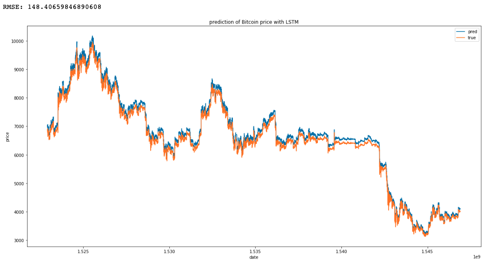

## prediction of BitCoin Price

Hello. This is the basic way of prediction Bitcoin price with LSTM model. 
We can also run time series prediction by this code.

 

### Usage

- data: bitcoin weighed price data(2014-12-01~2019-01-19)
    - location: https://www.kaggle.com/mczielinski/bitcoin-historical-data

- input: bitcoin weighted price before 3 days

- output: bitcoin weighted price today

- task: LSTM(opt: Adam, loss: MSE)

- normalization way: log and MinMaxScaler(scaled into 0~1)

 

### Result

